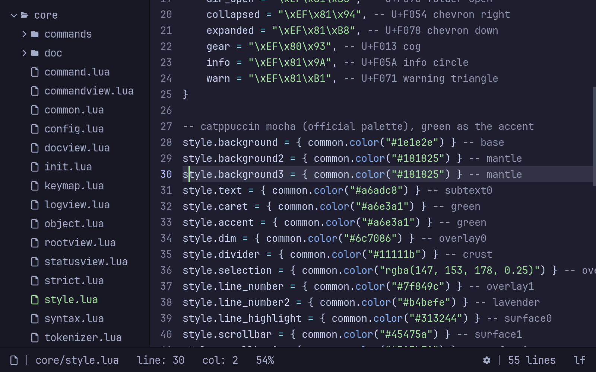
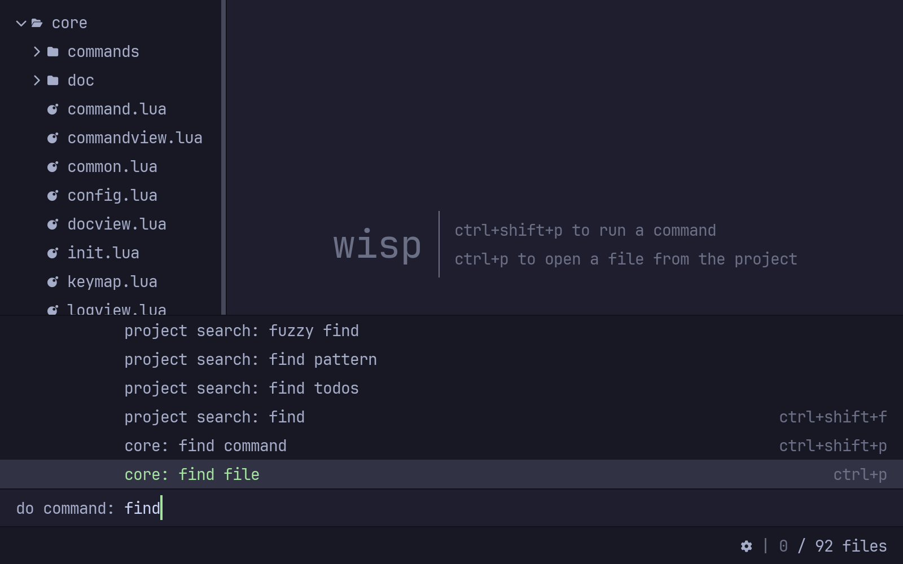

# wisp

a lightweight text editor in pure rust, after rxi's [lite](https://github.com/rxi/lite)

## what is this

[lite](https://github.com/rxi/lite) is a lovely idea: a tiny core that draws
text and reads input, and a whole editor written on top of it in lua. wisp
keeps the idea and rewrites the core -- c, sdl and stb replaced by ~3k lines
of safe rust. the lua layer is still lite's, byte for byte where possible,
bug-fixed where not. every deliberate difference is written down in
[DEVIATIONS.md](DEVIATIONS.md).

- pure rust: winit, softbuffer, swash. the only c compiled is lua itself
- everything you see is lua: views, syntax, commands, plugins -- all of it
  editable while the editor runs
- one font (jetbrains mono nerd font), one theme (catppuccin mocha, green
  caret), one binary
- `unsafe_code = "deny"`, with a single documented exception, and it's lua's
  fault
- the whole editor boots headless in the test suite: 80 tests feed it fake
  input and read the pixels coming back. the screenshots on this page were
  rendered that way too

## running

    cargo run --release -- <file or folder>

`ctrl+shift+p` runs commands, `ctrl+p` opens files, `WISP_SCALE=1.4` overrides
the display scale. the rest the editor will tell you itself.

## honesty

some help from the clankers went into this. love and care, however, were
certainly not missing: every line has been read, questioned, and plenty were
sent back.

## thanks

rxi, for lite -- go star it first.

## license

mit, shared with rxi. see [LICENSE](LICENSE).
